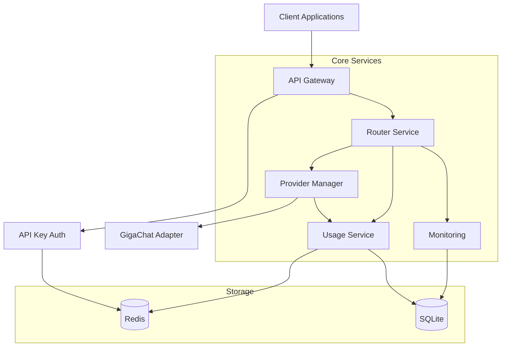
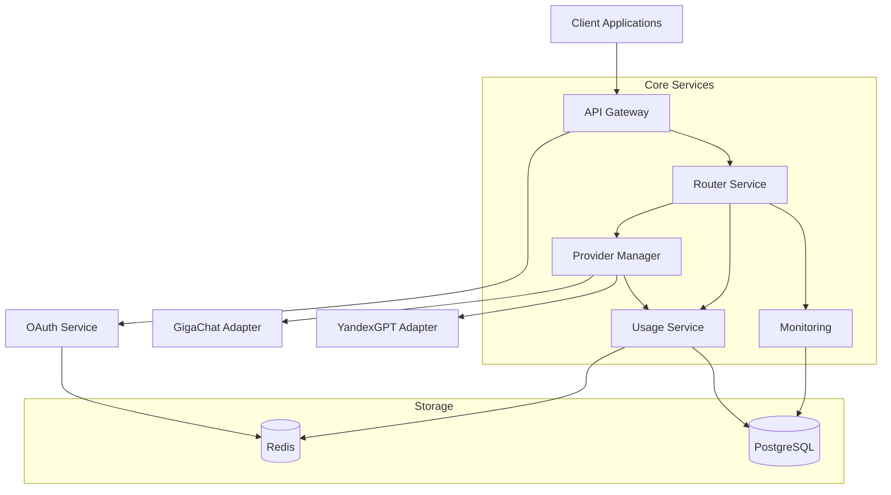
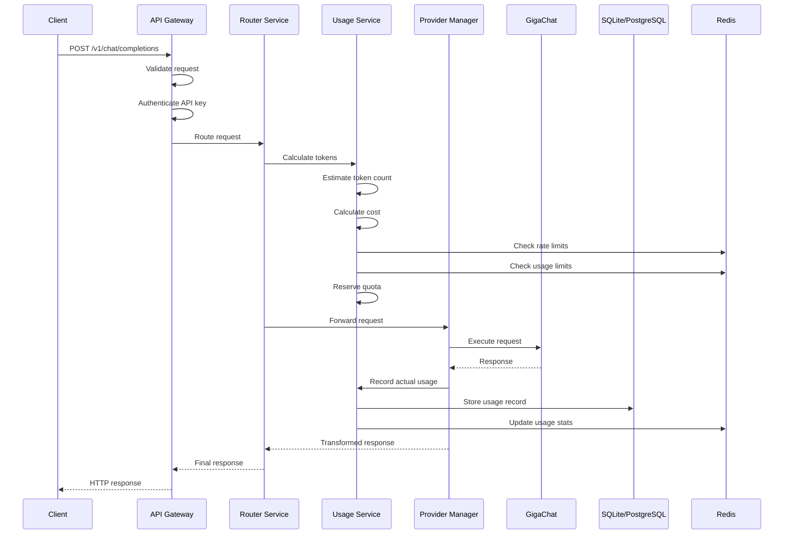

# XRouter Components Documentation

## Release Plan

### Release 1.0 - Foundation


### Release 1.1 - Enhancement (Planned)


## Core Services

### 1. API Gateway Service
```typescript
interface APIGateway {
  validateRequest(request: Request): Promise<ValidationResult>;
  authenticateRequest(request: Request): Promise<AuthResult>;
  routeRequest(request: Request): Promise<Response>;
  handleRateLimit(key: string): Promise<RateLimitResult>;
}
```

#### Release Support
- Release 1.0: 
  * Basic request validation
  * API key authentication
  * Rate limiting
  * Request logging
- Release 1.1:
  * OAuth 2.0 with PKCE
  * Enhanced validation
  * Advanced rate limiting

#### Key Features
- Request validation and sanitization
- Authentication and authorization
- Rate limiting and quota management
- Request logging and monitoring
- SSL/TLS termination

#### Dependencies
- Authentication Service
- Rate Limiter Service
- Monitoring Service

---

### 2. Router Service
```typescript
interface RouterService {
  resolveProvider(model: string): Promise<Provider>;
  transformRequest(request: Request, provider: Provider): Promise<TransformedRequest>;
  handleResponse(response: ProviderResponse): Promise<NormalizedResponse>;
  handleError(error: ProviderError): Promise<Response>;
}

interface ModelInfo {
  id: string;              // e.g. "gigachat-pro" или "yandexgpt-lite:latest"
  provider: string;        // "gigachat" | "yandexgpt"
  capabilities: {
    contextLength: number;
    maxTokens: number;
    features: string[];    // ["streaming", "function-calling", "json-mode"]
  };
}
```

#### Release Support
- Release 1.0:
  * GigaChat routing
  * Basic model listing
  * Request/response transformation
- Release 1.1:
  * YandexGPT routing
  * Version support
  * Enhanced transformation

#### Key Features
- Model resolution to provider
- Request transformation
- Response normalization
- Error handling

#### Dependencies
- Provider Manager
- Cache Service
- Monitoring Service

---

### 3. Provider Manager
```typescript
interface ProviderManager {
  getProvider(id: string): Promise<Provider>;
  checkHealth(provider: Provider): Promise<HealthStatus>;
  executeRequest(request: TransformedRequest, provider: Provider): Promise<ProviderResponse>;
  handleRetry(request: TransformedRequest, error: Error): Promise<ProviderResponse>;
}

interface Provider {
  id: string;
  name: string;
  endpoint: string;
  capabilities: ModelCapabilities;
  authenticate(): Promise<void>;
  execute(request: TransformedRequest): Promise<ProviderResponse>;
}
```

#### Release Support
- Release 1.0:
  * GigaChat adapter
  * Basic health checks
  * Error handling
- Release 1.1:
  * YandexGPT adapter
  * Advanced health monitoring
  * Enhanced error handling

#### Provider Adapters

##### GigaChat Adapter (Release 1.0)
```typescript
class GigaChatAdapter implements Provider {
  capabilities: {
    maxTokens: 32768,
    supportedModels: [
      'gigachat',      // Lite версия
      'gigachat-pro',  // Pro версия
      'gigachat-max'   // Max версия
    ],
    features: ['streaming', 'function-calling', 'json-mode', 'images']
  };
}
```

##### YandexGPT Adapter (Release 1.1)
```typescript
class YandexGPTAdapter implements Provider {
  capabilities: {
    supportedModels: [
      'yandexgpt-lite:latest',
      'yandexgpt-lite:rc',
      'yandexgpt-lite:deprecated',
      'yandexgpt:latest',
      'yandexgpt:rc',
      'yandexgpt:deprecated',
      'yandexgpt-32k:latest',
      'yandexgpt-32k:rc',
      'yandexgpt-32k:deprecated'
    ],
    maxTokens: {
      'yandexgpt-lite': 8192,
      'yandexgpt': 8192,
      'yandexgpt-32k': 32768
    },
    features: ['streaming', 'json-mode']
  };
}
```

---

### 4. Authentication Service
```typescript
interface AuthService {
  validateToken(token: string): Promise<TokenValidation>;
  generateToken(user: User): Promise<Token>;
  revokeToken(token: string): Promise<void>;
  validateAPIKey(key: string): Promise<APIKeyValidation>;
}

interface OAuthService {
  initiateOAuth(request: OAuthRequest): Promise<OAuthResponse>;
  handleCallback(code: string): Promise<TokenResponse>;
  refreshToken(refreshToken: string): Promise<TokenResponse>;
}
```

#### Release Support
- Release 1.0:
  * API key validation
  * Basic token management
  * Rate limit enforcement
- Release 1.1:
  * OAuth 2.0 with PKCE
  * Enhanced token management
  * Permission management

#### Key Features
- API key management
- Token validation and refresh
- Permission management
- User management

#### Dependencies
- Database Service
- Cache Service
- Monitoring Service

---

### 5. Cache Service
```typescript
interface CacheService {
  get(key: string): Promise<CachedData | null>;
  set(key: string, value: any, ttl?: number): Promise<void>;
  delete(key: string): Promise<void>;
  invalidate(pattern: string): Promise<void>;
}

interface CacheConfig {
  defaultTTL: number;
  rateLimitTTL: number;     // TTL для rate limiting счетчиков (минуты)
  apiKeyCacheTTL: number;   // TTL для кэша валидации ключей (минуты)
  monitoringTTL: number;    // TTL для метрик и статусов (минуты)
}
```

#### Release Support
- Release 1.0:
  * Rate limiting
  * API key caching
  * Basic provider status
- Release 1.1:
  * Enhanced caching
  * Session management
  * Distributed locking

#### Key Features

1. Rate Limiting:
   - Подсчет запросов по времени
   - Ограничение нагрузки по ключам
   - Защита от DDoS
   - Квоты на использование

2. Кэширование API ключей:
   - Быстрая валидация через кэш
   - Снижение нагрузки на БД

3. Мониторинг провайдеров:
   - Статус доступности в реальном времени
   - Метрики производительности
   - История ошибок
   - Временные проблемы с доступом

#### Implementation
```typescript
class RedisCacheService implements CacheService {
  constructor(
    private redis: Redis,
    private config: CacheConfig
  ) {}
  
  async set(key: string, value: any, ttl?: number): Promise<void> {
    const serialized = JSON.stringify(value);
    if (ttl) {
      await this.redis.setex(key, ttl, serialized);
    } else {
      await this.redis.set(key, serialized);
    }
  }
}
```

---

### 6. Monitoring Service
```typescript
interface MonitoringService {
  recordMetric(metric: Metric): Promise<void>;
  recordError(error: Error): Promise<void>;
  checkHealth(service: string): Promise<HealthStatus>;
  getMetrics(query: MetricQuery): Promise<MetricData[]>;
  getProviderStatus(provider: string): Promise<ProviderStatus>;
}

interface ProviderStatus {
  status: "operational" | "degraded" | "down";
  latency: number;
  success_rate: number;
  last_updated: string;
  models: {
    [modelId: string]: {
      status: string;
      last_updated: string;
    };
  };
}
```

#### Release Support
- Release 1.0:
  * Basic metrics
  * Error tracking
  * Provider status
- Release 1.1:
  * Advanced metrics
  * Detailed analytics
  * SLA monitoring

#### Key Features
- Performance metrics collection
- Error tracking and reporting
- Health checking
- Provider status monitoring
- Model status tracking

#### Metrics Collected
- Request latency
- Error rates
- Provider availability
- Token usage
- Cache hit rates
- Resource utilization

---

### 7. Usage Service
```typescript
interface UsageService {
  // Подсчет токенов и стоимости
  calculateTokens(request: Request): Promise<TokenCount>;
  calculateCost(tokens: TokenCount, model: string): Promise<Cost>;
  
  // Запись использования
  recordUsage(usage: Usage): Promise<void>;
  recordBatchUsage(usages: Usage[]): Promise<void>;
  
  // Получение статистики
  getUsageByApiKey(apiKey: string, period?: Period): Promise<UsageStats>;
  getUsageByModel(model: string, period?: Period): Promise<UsageStats>;
  getProviderUsage(provider: string, period?: Period): Promise<UsageStats>;
  
  // Проверка лимитов
  checkLimit(apiKey: string): Promise<LimitCheck>;
  reserveQuota(apiKey: string, tokens: TokenCount): Promise<QuotaReservation>;
  releaseQuota(reservation: QuotaReservation): Promise<void>;
}

interface TokenCount {
  input: number;
  output: number;
  total: number;
  model: string;
}

interface Cost {
  amount: number;
  currency: string;
  breakdown: {
    input: number;
    output: number;
    markup?: number;
  };
}

interface Usage {
  id: string;
  apiKey: string;
  provider: string;
  model: string;  // Включая версию, например "yandexgpt-lite:latest"
  tokens: TokenCount;
  cost: Cost;
  metadata?: {
    request_id?: string;
    user_id?: string;
    tags?: string[];
  };
  timestamp: Date;
}

interface UsageStats {
  total_tokens: TokenCount;
  total_cost: Cost;
  request_count: number;
  average_latency: number;
  error_rate: number;
  usage_by_day: {
    date: string;
    tokens: TokenCount;
    cost: Cost;
  }[];
}

interface LimitCheck {
  allowed: boolean;
  current_usage: number;
  limit: number;
  reset_at: Date;
  warnings?: string[];
}

interface QuotaReservation {
  id: string;
  apiKey: string;
  tokens: TokenCount;
  expires_at: Date;
}
```

#### Release Support
- Release 1.0:
  * Базовый подсчет токенов
  * Запись использования в SQLite
  * Простая проверка лимитов
  * Базовая статистика
- Release 1.1:
  * Расширенная статистика
  * Поддержка тегов и метаданных
  * Квоты и резервирование
  * Агрегация по пользователям

#### Key Features
- Точный подсчет токенов и стоимости
- Детальная история использования
- Гибкая система лимитов и квот
- Кэширование статистики
- Агрегация по разным измерениям

#### Dependencies
- Router Service (для получения информации о запросах)
- Provider Manager (для получения результатов использования)
- Auth Service (для проверки API ключей)
- Cache Service (для кэширования статистики)
- Database Service (для хранения истории)

#### Implementation Details

##### Token Calculation
```typescript
class TokenCalculator {
  async calculateTokens(request: Request, model: string): Promise<TokenCount> {
    const provider = await this.providerManager.getProvider(model);
    return provider.calculateTokens(request);
  }

  async calculateCost(tokens: TokenCount, model: string): Promise<Cost> {
    const pricing = await this.getPricing(model);
    return {
      amount: (tokens.input * pricing.input_rate) +
              (tokens.output * pricing.output_rate),
      currency: pricing.currency,
      breakdown: {
        input: tokens.input * pricing.input_rate,
        output: tokens.output * pricing.output_rate
      }
    };
  }
}
```

##### Usage Recording
```typescript
class UsageRecorder {
  async recordUsage(usage: Usage): Promise<void> {
    // Записываем в БД
    await this.db.insertUsage(usage);
    
    // Обновляем кэш
    await this.cache.incrementUsage(usage.apiKey, usage.tokens);
    
    // Отправляем метрики
    await this.monitoring.recordMetric({
      name: 'token_usage',
      value: usage.tokens.total,
      tags: {
        api_key: usage.apiKey,
        model: usage.model,
        provider: usage.provider
      }
    });
  }
}
```

##### Limit Checking
```typescript
class LimitChecker {
  async checkLimit(apiKey: string): Promise<LimitCheck> {
    // Проверяем кэш
    const cached = await this.cache.getUsage(apiKey);
    if (cached) {
      return this.validateLimit(cached);
    }

    // Если нет в кэше, считаем из БД
    const usage = await this.db.calculateUsage(apiKey);
    await this.cache.setUsage(apiKey, usage);
    
    return this.validateLimit(usage);
  }

  private validateLimit(usage: number): LimitCheck {
    const limit = this.getLimitForKey(usage.apiKey);
    return {
      allowed: usage < limit,
      current_usage: usage,
      limit: limit,
      reset_at: this.getNextReset()
    };
  }
}
```

---

## Request Flow

### Chat Completion Flow


### Процесс обработки запроса

1. Входящий запрос (API Gateway)
   - Валидация формата запроса
   - Проверка API ключа
   - Rate limiting через Redis

2. Предварительная обработка (Router Service)
   - Определение модели и провайдера
   - Проверка доступности провайдера
   - Подготовка запроса к трансформации

3. Проверка и резервирование квоты (Usage Service)
   - Подсчет ожидаемых токенов
   - Расчет предполагаемой стоимости
   - Проверка лимитов пользователя
   - Резервирование квоты

4. Выполнение запроса (Provider Manager)
   - Трансформация запроса для провайдера
   - Отправка запроса провайдеру
   - Получение ответа
   - Обработка ошибок

5. Учет использования (Usage Service)
   - Подсчет фактических токенов
   - Расчет итоговой стоимости
   - Запись использования в БД
   - Обновление статистики в кэше

6. Формирование ответа (Router Service)
   - Нормализация ответа провайдера
   - Добавление метаданных использования
   - Обработка ошибок

### Обработка ошибок

1. Ошибки валидации
   ```typescript
   interface ValidationError {
     code: 400;
     message: string;
     details: {
       field: string;
       error: string;
     }[];
   }
   ```

2. Ошибки лимитов
   ```typescript
   interface LimitError {
     code: 429;
     message: string;
     details: {
       current_usage: number;
       limit: number;
       reset_at: string;
     };
   }
   ```

3. Ошибки провайдера
   ```typescript
   interface ProviderError {
     code: 502;
     message: string;
     details: {
       provider: string;
       raw_error: string;
     };
   }
   ```

---

## Database Schema

### Release 1.0 - SQLite Schema

#### API Keys Table
```sql
CREATE TABLE api_keys (
  id TEXT PRIMARY KEY,
  key_hash TEXT NOT NULL,
  name TEXT,
  created_at TIMESTAMP DEFAULT CURRENT_TIMESTAMP,
  expires_at TIMESTAMP,
  last_used_at TIMESTAMP
);
```

#### Usage Table
```sql
CREATE TABLE usage (
  id TEXT PRIMARY KEY,
  api_key_id TEXT REFERENCES api_keys(id),
  provider TEXT NOT NULL,
  model TEXT NOT NULL,
  tokens_input INTEGER NOT NULL,
  tokens_output INTEGER NOT NULL,
  cost DECIMAL(10,6) NOT NULL,
  created_at TIMESTAMP DEFAULT CURRENT_TIMESTAMP
);
```

#### Provider Status Table
```sql
CREATE TABLE provider_status (
  id TEXT PRIMARY KEY,
  provider TEXT NOT NULL,
  model TEXT NOT NULL,
  status TEXT NOT NULL,
  latency INTEGER,
  error_rate DECIMAL(5,2),
  updated_at TIMESTAMP DEFAULT CURRENT_TIMESTAMP
);
```

### Release 1.1 - PostgreSQL Schema

#### Users Table
```sql
CREATE TABLE users (
  id UUID PRIMARY KEY,
  email VARCHAR(255) UNIQUE NOT NULL,
  created_at TIMESTAMP WITH TIME ZONE DEFAULT CURRENT_TIMESTAMP,
  updated_at TIMESTAMP WITH TIME ZONE DEFAULT CURRENT_TIMESTAMP
);
```

#### API Keys Table
```sql
CREATE TABLE api_keys (
  id UUID PRIMARY KEY,
  user_id UUID REFERENCES users(id),
  key_hash VARCHAR(255) NOT NULL,
  name VARCHAR(255),
  created_at TIMESTAMP WITH TIME ZONE DEFAULT CURRENT_TIMESTAMP,
  expires_at TIMESTAMP WITH TIME ZONE,
  last_used_at TIMESTAMP WITH TIME ZONE,
  CONSTRAINT fk_user FOREIGN KEY(user_id) REFERENCES users(id)
);
```

#### Usage Table
```sql
CREATE TABLE usage (
  id UUID PRIMARY KEY,
  user_id UUID REFERENCES users(id),
  provider VARCHAR(50) NOT NULL,
  model VARCHAR(100) NOT NULL,  -- Включая версию, например "yandexgpt-lite:latest"
  tokens_input INTEGER NOT NULL,
  tokens_output INTEGER NOT NULL,
  cost DECIMAL(10,6) NOT NULL,
  created_at TIMESTAMP WITH TIME ZONE DEFAULT CURRENT_TIMESTAMP,
  CONSTRAINT fk_user FOREIGN KEY(user_id) REFERENCES users(id)
);
```

#### Provider Status Table
```sql
CREATE TABLE provider_status (
  id UUID PRIMARY KEY,
  provider VARCHAR(50) NOT NULL,
  model VARCHAR(100) NOT NULL,  -- Включая версию
  status VARCHAR(20) NOT NULL,
  latency INTEGER,
  error_rate DECIMAL(5,2),
  updated_at TIMESTAMP WITH TIME ZONE DEFAULT CURRENT_TIMESTAMP
);
```

---

## Service Communication

### Release 1.0
- REST APIs between services
- Redis pub/sub for rate limiting
- SQLite for persistent storage
- Basic logging

### Release 1.1 (Planned)
- Enhanced REST APIs
- gRPC for high-performance internal communication
- PostgreSQL for persistent storage
- Redis for caching and session management

### Message Formats
```typescript
interface ServiceMessage {
  id: string;
  type: MessageType;
  payload: any;
  timestamp: Date;
  source: string;
  destination: string;
}

interface ServiceResponse {
  id: string;
  status: ResponseStatus;
  data?: any;
  error?: ServiceError;
  timestamp: Date;
}