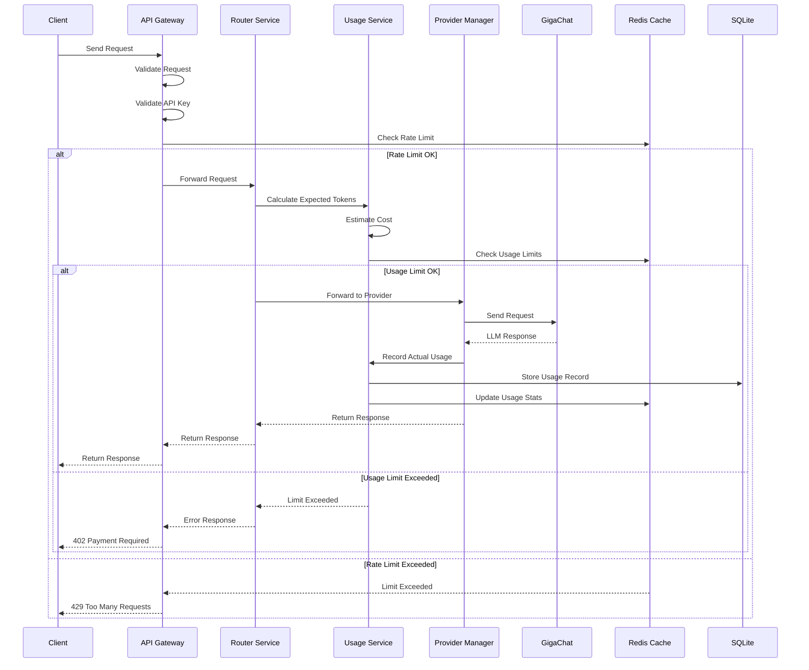
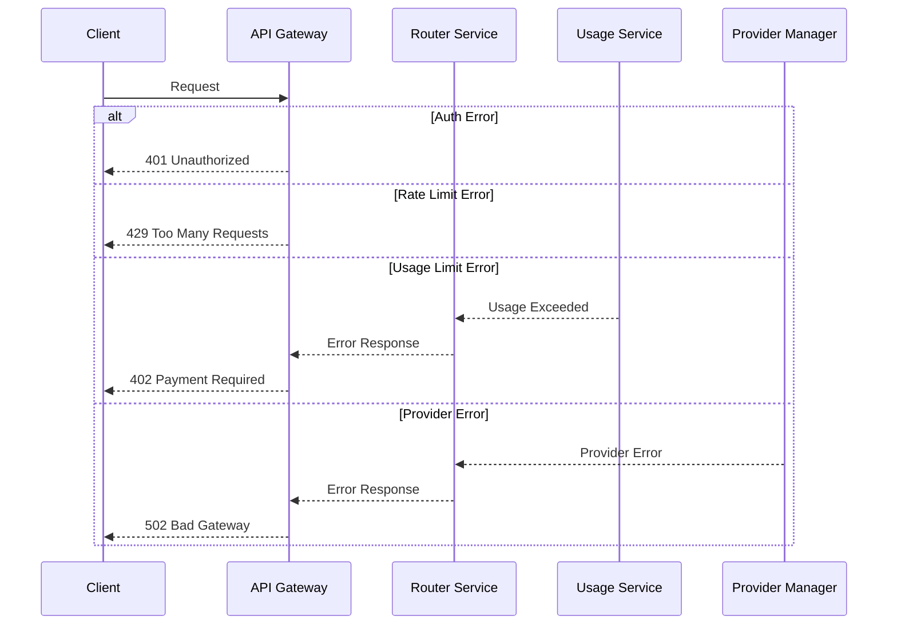
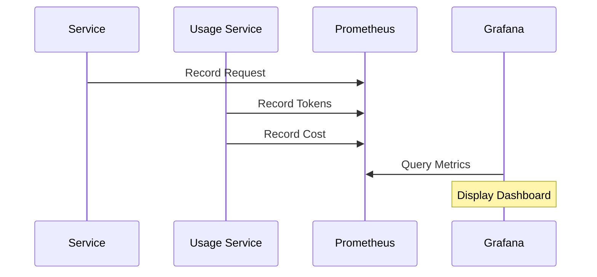

# XRouter Data Flow Documentation

## Release 1.0 - Foundation

### Request Flow


### Implementation Details

#### API Gateway
```python
from fastapi import FastAPI, HTTPException
from redis import Redis
from sqlite3 import connect

app = FastAPI()
redis = Redis()
db = connect('xrouter.db')

@app.post("/v1/chat/completions")
async def chat_completions(request: ChatRequest):
    # API Key validation
    if not validate_api_key(request.api_key):
        raise HTTPException(401)
    
    # Rate limiting
    if not check_rate_limit(request.api_key):
        raise HTTPException(429)
    
    # Usage check
    usage = await usage_service.check_limits(request.api_key)
    if not usage.allowed:
        raise HTTPException(402)
    
    # Route request
    response = await router.process_request(request)
    return response
```

#### Router Service
```python
class RouterService:
    def __init__(self, provider_manager: ProviderManager, usage_service: UsageService):
        self.provider_manager = provider_manager
        self.usage_service = usage_service

    async def process_request(self, request: ChatRequest) -> ChatResponse:
        # Calculate expected tokens
        expected_tokens = await self.usage_service.calculate_tokens(request)
        
        # Check usage limits
        if not await self.usage_service.check_limits(request.api_key, expected_tokens):
            raise UsageLimitExceeded()
        
        # Get provider
        provider = self.provider_manager.get_provider(request.model)
        
        # Execute request
        response = await provider.execute(request)
        
        # Record actual usage
        await self.usage_service.record_usage(Usage(
            api_key=request.api_key,
            provider=provider.name,
            model=request.model,
            tokens=response.usage,
            cost=response.cost
        ))
        
        return response
```

#### Provider Manager
```python
class ProviderManager:
    def __init__(self, usage_service: UsageService):
        self.usage_service = usage_service
        self.gigachat_client = GigaChatClient()
        self.metrics = MetricsClient()

    def get_provider(self, model: str) -> Provider:
        if model.startswith('gigachat'):
            return self.gigachat_client
        raise UnsupportedModelError(model)

    async def execute(self, request: ProviderRequest) -> ProviderResponse:
        provider = self.get_provider(request.model)
        
        try:
            # Execute request
            response = await provider.complete(request)
            
            # Record metrics
            await self.metrics.record_request(provider.name, request.model)
            await self.metrics.record_tokens(
                provider.name,
                response.usage.input,
                response.usage.output
            )
            
            return response
        except Exception as e:
            await self.metrics.record_error(provider.name, str(e))
            raise

class GigaChatClient(Provider):
    async def complete(self, request: ProviderRequest) -> ProviderResponse:
        # Transform request for GigaChat
        gigachat_request = self.transform_request(request)
        
        # Execute request
        response = await self.client.create_completion(gigachat_request)
        
        # Transform response
        return self.transform_response(response)
```

#### Usage Service
```python
class UsageService:
    def __init__(self, db: Database, cache: Redis):
        self.db = db
        self.cache = cache

    async def calculate_tokens(self, request: ChatRequest) -> TokenCount:
        # Estimate input tokens
        input_tokens = self.count_tokens(request.messages)
        
        # Estimate output tokens based on max_tokens or model defaults
        output_tokens = request.max_tokens or self.get_default_max_tokens(request.model)
        
        return TokenCount(
            input=input_tokens,
            output=output_tokens,
            total=input_tokens + output_tokens,
            model=request.model
        )

    async def check_limits(self, api_key: str, expected_tokens: TokenCount) -> bool:
        # Get current usage from cache
        current = await self.cache.get(f"usage:{api_key}")
        if current is None:
            # If not in cache, get from DB
            current = await self.db.get_usage(api_key)
            await self.cache.set(f"usage:{api_key}", current)
        
        # Get limits
        limits = await self.get_limits(api_key)
        
        # Check if would exceed
        return (current + expected_tokens.total) <= limits.max_tokens

    async def record_usage(self, usage: Usage):
        # Store in DB
        await self.db.insert_usage(usage)
        
        # Update cache
        await self.cache.increment(f"usage:{usage.api_key}", usage.tokens.total)
        
        # Record metrics
        await self.metrics.record_usage(usage)
```

### Data Storage

#### SQLite Schema
```sql
-- API Keys
CREATE TABLE api_keys (
    id TEXT PRIMARY KEY,
    key_hash TEXT NOT NULL,
    name TEXT,
    created_at TIMESTAMP DEFAULT CURRENT_TIMESTAMP,
    expires_at TIMESTAMP,
    last_used_at TIMESTAMP
);

-- Usage Records
CREATE TABLE usage (
    id TEXT PRIMARY KEY,
    api_key_id TEXT REFERENCES api_keys(id),
    provider TEXT NOT NULL,
    model TEXT NOT NULL,
    tokens_input INTEGER NOT NULL,
    tokens_output INTEGER NOT NULL,
    cost DECIMAL(10,6) NOT NULL,
    created_at TIMESTAMP DEFAULT CURRENT_TIMESTAMP
);

-- Provider Status
CREATE TABLE provider_status (
    id TEXT PRIMARY KEY,
    provider TEXT NOT NULL,
    model TEXT NOT NULL,
    status TEXT NOT NULL,
    latency INTEGER,
    error_rate DECIMAL(5,2),
    updated_at TIMESTAMP DEFAULT CURRENT_TIMESTAMP
);
```

#### Redis Schema
```python
class RedisKeys:
    # Rate Limiting
    RATE_LIMIT = "rate:{api_key}:{window}"
    
    # Usage Stats
    USAGE_COUNTER = "usage:{api_key}:counter"
    USAGE_HISTORY = "usage:{api_key}:history"
    
    # Provider Status
    PROVIDER_STATUS = "provider:{name}:status"
    MODEL_STATUS = "model:{name}:status"
```

### Error Handling

#### Error Types
```python
class ErrorCode(str, Enum):
    AUTH_ERROR = "auth_error"
    VALIDATION_ERROR = "validation_error"
    RATE_LIMIT_ERROR = "rate_limit_error"
    USAGE_LIMIT_ERROR = "usage_limit_error"
    PROVIDER_ERROR = "provider_error"
    INTERNAL_ERROR = "internal_error"

class XRouterError(Exception):
    def __init__(self, code: ErrorCode, message: str, details: dict = None):
        self.code = code
        self.message = message
        self.details = details or {}
```

#### Error Flow


### Monitoring

#### Metrics Collection
```python
class Metrics:
    async def record_request(self, provider: str, model: str):
        await self.increment_counter("requests_total", {"provider": provider, "model": model})
    
    async def record_tokens(self, provider: str, input_tokens: int, output_tokens: int):
        await self.increment_counter("tokens_total", {
            "provider": provider,
            "type": "input"
        }, input_tokens)
        await self.increment_counter("tokens_total", {
            "provider": provider,
            "type": "output"
        }, output_tokens)
    
    async def record_cost(self, provider: str, cost: float):
        await self.increment_counter("cost_total", {"provider": provider}, cost)
```

#### Metric Flow


## Release 1.1 - Enhancement (Planned)

### Additional Components

1. OAuth Service
2. YandexGPT Provider
3. PostgreSQL Migration
4. Enhanced Monitoring

Detailed implementation will be added when Release 1.1 development begins.