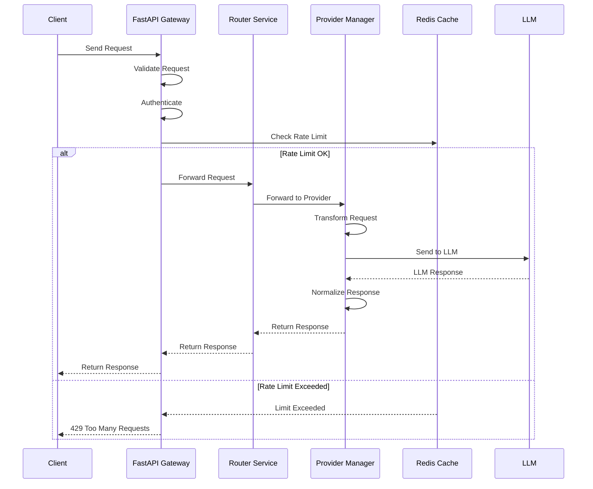
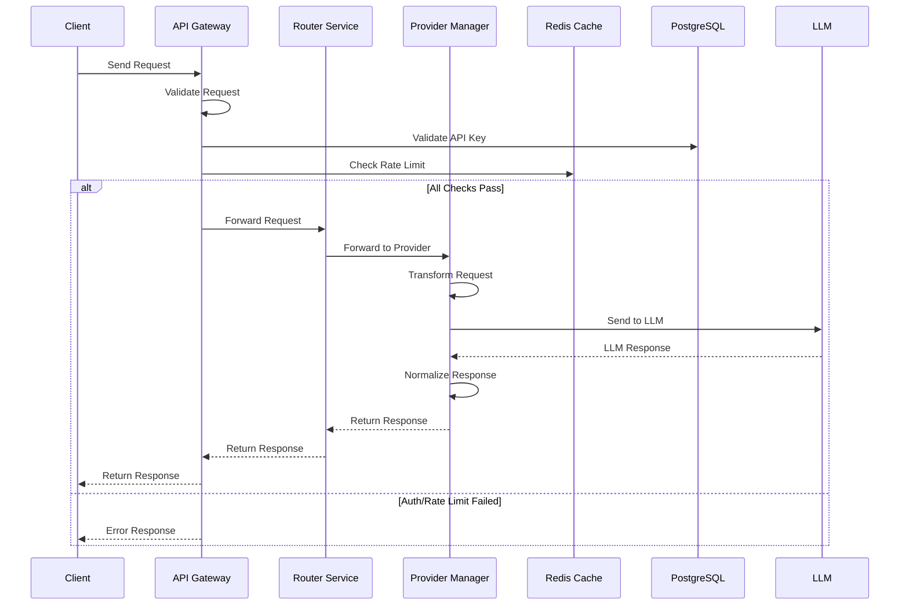
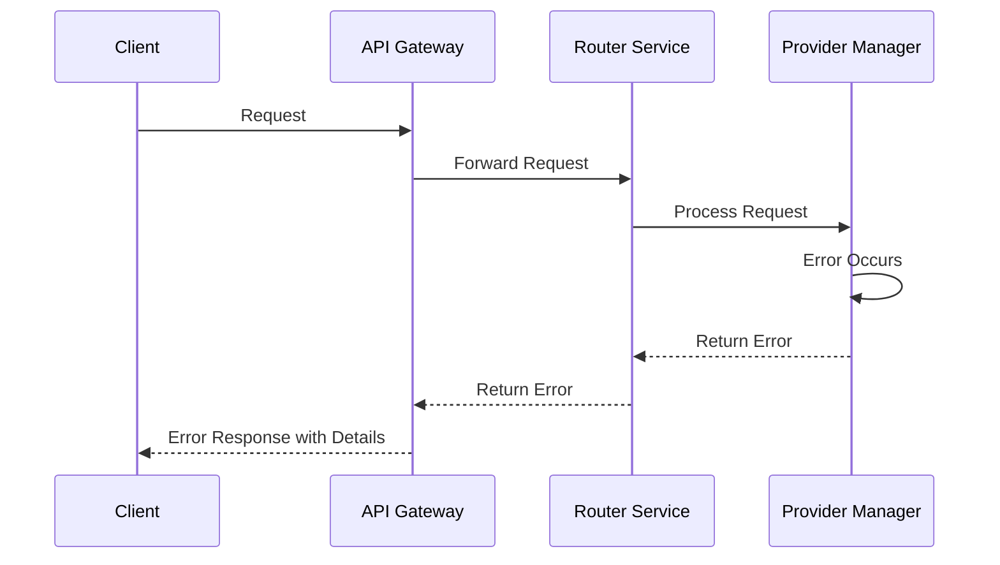
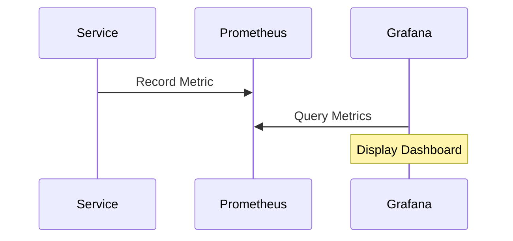
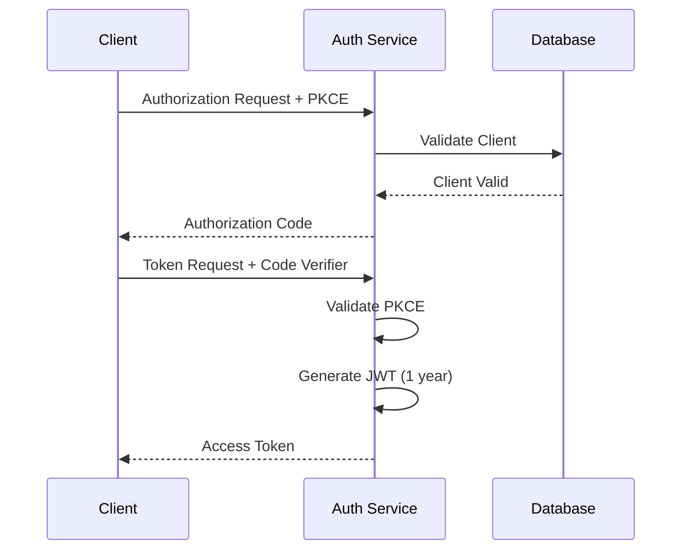

# XRouter Data Flow Documentation

## MVP (Python)

### Request Flow


### Implementation Details
```python
# FastAPI Gateway
from fastapi import FastAPI, HTTPException
from redis import Redis

app = FastAPI()
redis = Redis()

@app.post("/v1/chat/completions")
async def chat_completions(request: ChatRequest):
    # Rate limiting
    if not check_rate_limit(request.api_key):
        raise HTTPException(429)
    
    # Authentication
    if not validate_api_key(request.api_key):
        raise HTTPException(401)
    
    # Route request
    response = await router.process_request(request)
    return response

# Router Service
class RouterService:
    async def process_request(self, request: ChatRequest) -> ChatResponse:
        provider = self.resolve_provider(request.model)
        transformed = provider.transform_request(request)
        response = await provider.execute(transformed)
        return response

# Provider Manager
class ProviderManager:
    async def execute(self, request: ProviderRequest) -> ProviderResponse:
        if request.model.startswith('gigachat'):
            return await self.gigachat_client.complete(request)
        elif request.model.startswith('yandexgpt'):
            return await self.yandex_client.complete(request)
```

## Production (Go)

### Request Flow


### Implementation Details
```go
// API Gateway
type Gateway struct {
    router  *Router
    cache   *redis.Client
    db      *sql.DB
    metrics *prometheus.Client
}

func (g *Gateway) HandleRequest(w http.ResponseWriter, r *http.Request) {
    // Validate request
    if err := g.validateRequest(r); err != nil {
        g.sendError(w, err)
        return
    }

    // Check rate limit
    if err := g.checkRateLimit(r); err != nil {
        g.sendError(w, err)
        return
    }

    // Process request
    resp, err := g.router.ProcessRequest(r.Context(), r)
    if err != nil {
        g.sendError(w, err)
        return
    }

    g.sendResponse(w, resp)
}

// Router Service
type Router struct {
    providers map[string]Provider
    metrics   *prometheus.Client
}

func (r *Router) ProcessRequest(ctx context.Context, req *Request) (*Response, error) {
    // Resolve provider
    provider, err := r.resolveProvider(req.Model)
    if err != nil {
        return nil, err
    }

    // Transform and execute
    transformed := provider.TransformRequest(req)
    return provider.Execute(ctx, transformed)
}

// Provider Manager
type Provider interface {
    TransformRequest(*Request) *ProviderRequest
    Execute(context.Context, *ProviderRequest) (*Response, error)
}

type GigaChatProvider struct {
    client *gigachat.Client
}

type YandexGPTProvider struct {
    client *yandexgpt.Client
}
```

## Error Handling

### Error Types
```go
type ErrorCode string

const (
    ErrAuthentication ErrorCode = "auth_error"
    ErrValidation    ErrorCode = "validation_error"
    ErrRateLimit     ErrorCode = "rate_limit_error"
    ErrProvider      ErrorCode = "provider_error"
    ErrInternal      ErrorCode = "internal_error"
)

type Error struct {
    Code    ErrorCode
    Message string
    Details map[string]interface{}
}
```

### Error Flow


## Monitoring

### Metrics Collection
```go
type Metrics interface {
    RecordRequest(provider, model string)
    RecordLatency(provider string, duration time.Duration)
    RecordError(provider string, err error)
    RecordTokens(provider string, input, output int)
}
```

### Metric Flow


## OAuth Flow

### MVP OAuth (Python)
```python
from fastapi import FastAPI, Depends
from fastapi.security import OAuth2AuthorizationCodeBearer
from fastapi_oauth2 import OAuth2

# OAuth2 configuration
oauth2_scheme = OAuth2AuthorizationCodeBearer(
    tokenUrl="token",
    authorizationUrl="authorize"
)

@app.post("/token")
async def token(code: str, code_verifier: str):
    # Validate PKCE
    if not validate_pkce(code, code_verifier):
        raise HTTPException(400)
    
    # Generate token (1 year)
    token = create_jwt_token(
        user_id=user.id,
        expires_delta=timedelta(days=365)
    )
    
    return {"access_token": token}
```

### Production OAuth (Go)
```go
import (
    "github.com/golang-jwt/jwt/v5"
)

type OAuthHandler struct {
    db      *sql.DB
    cache   *redis.Client
}

func (h *OAuthHandler) HandleToken(w http.ResponseWriter, r *http.Request) {
    // Validate PKCE
    code := r.FormValue("code")
    verifier := r.FormValue("code_verifier")
    
    if !validatePKCE(code, verifier) {
        http.Error(w, "Invalid code", 400)
        return
    }
    
    // Generate JWT (1 year)
    token := jwt.NewWithClaims(jwt.SigningMethodHS256, jwt.MapClaims{
        "sub": userID,
        "exp": time.Now().AddDate(1, 0, 0).Unix(),
    })
    
    tokenString, _ := token.SignedString(jwtSecret)
    json.NewEncoder(w).Encode(map[string]string{
        "access_token": tokenString,
    })
}
```

### OAuth Flow Diagram
