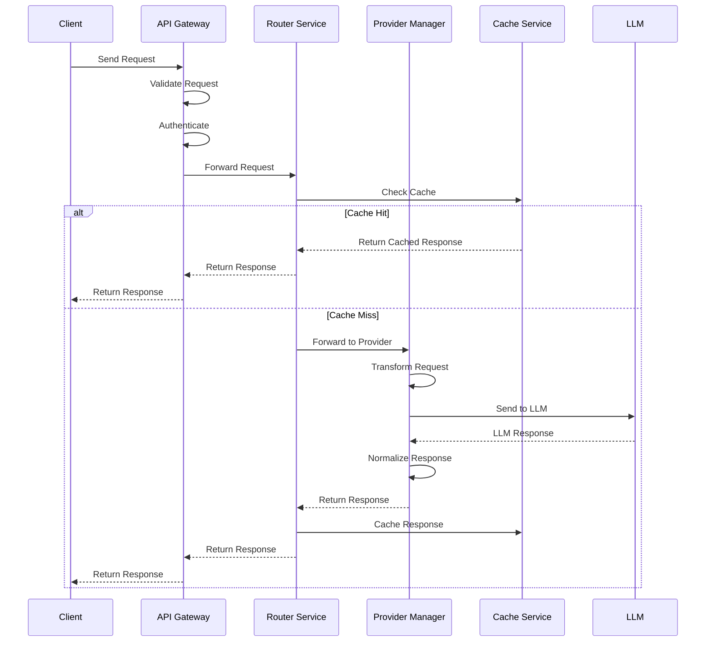
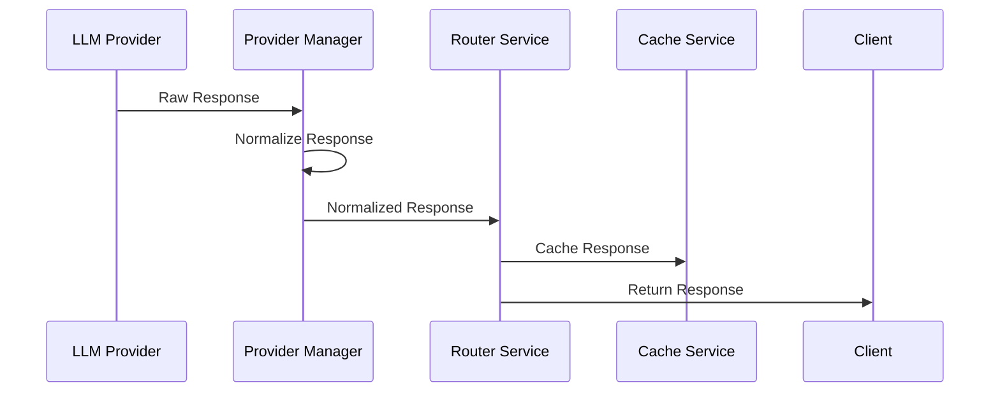
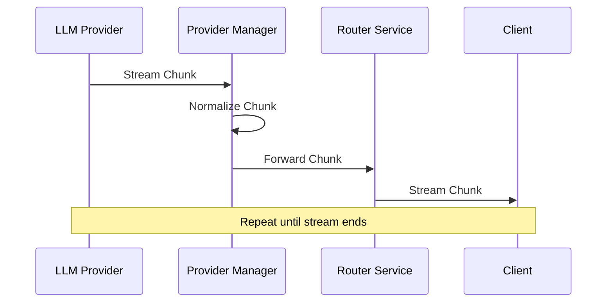
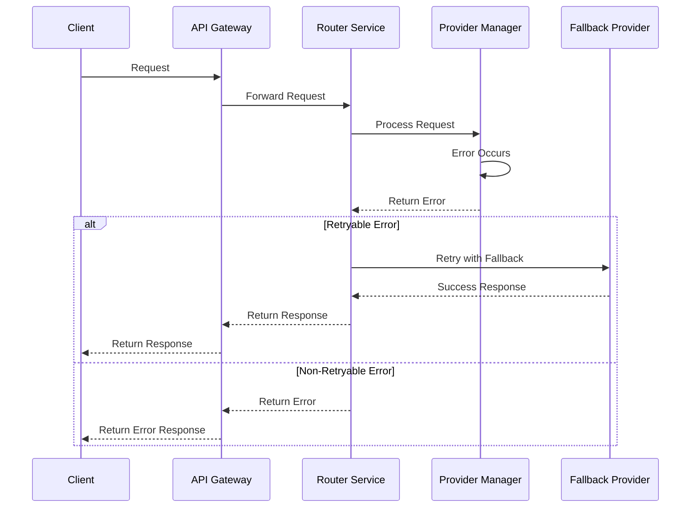
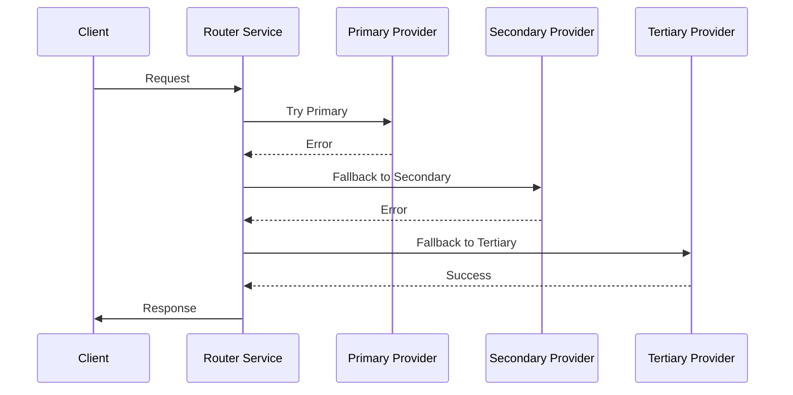
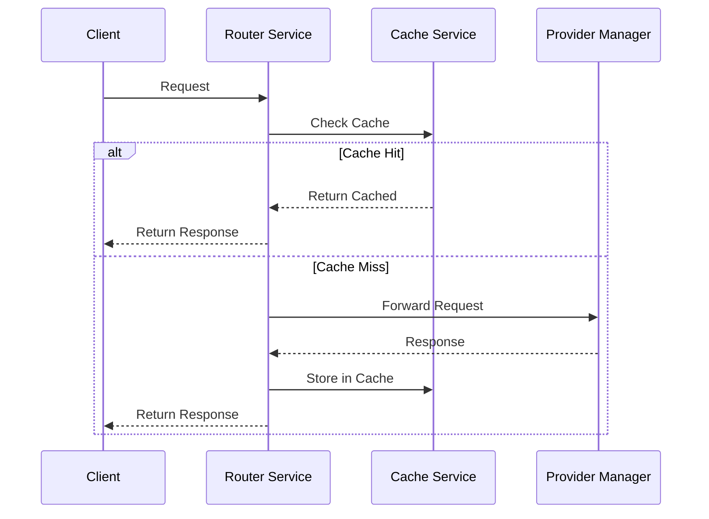
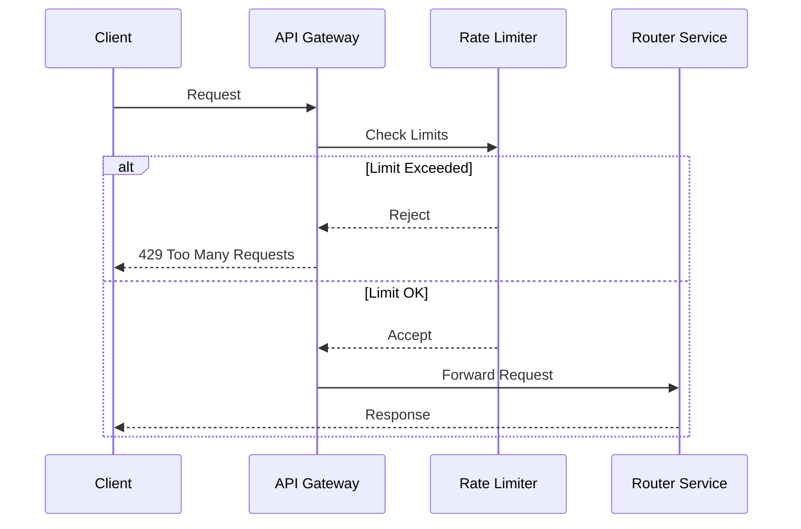

# XRouter Data Flow Documentation

## Request Flow

### 1. Client Request Processing


### 2. Request Transformation
```typescript
interface ClientRequest {
  model: string;
  messages: Message[];
  parameters: ModelParameters;
  stream?: boolean;
}

interface ProviderRequest {
  prompt: string;
  max_tokens: number;
  temperature: number;
  provider_specific_params: Record<string, any>;
}

// Transformation Process
function transformRequest(request: ClientRequest, provider: Provider): ProviderRequest {
  return {
    prompt: formatPrompt(request.messages),
    max_tokens: calculateMaxTokens(request.parameters),
    temperature: request.parameters.temperature ?? provider.defaults.temperature,
    provider_specific_params: mapProviderParams(request.parameters, provider)
  };
}
```

## Response Flow

### 1. Standard Response Processing


### 2. Streaming Response Processing


## Error Handling

### 1. Error Types
```typescript
interface ServiceError {
  code: ErrorCode;
  message: string;
  details?: Record<string, any>;
  retryable: boolean;
}

enum ErrorCode {
  AUTHENTICATION_ERROR = 'auth_error',
  VALIDATION_ERROR = 'validation_error',
  PROVIDER_ERROR = 'provider_error',
  RATE_LIMIT_ERROR = 'rate_limit_error',
  INTERNAL_ERROR = 'internal_error'
}
```

### 2. Error Flow


## Fallback Mechanism

### 1. Provider Fallback
```typescript
interface FallbackStrategy {
  shouldFallback(error: ServiceError): boolean;
  getFallbackProvider(currentProvider: Provider): Provider;
  maxRetries: number;
}

class ProviderFallback {
  async executeWithFallback(request: ClientRequest): Promise<Response> {
    let attempts = 0;
    let lastError: ServiceError;
    
    while (attempts < this.strategy.maxRetries) {
      try {
        const provider = this.getNextProvider(attempts);
        return await provider.execute(request);
      } catch (error) {
        lastError = error;
        if (!this.strategy.shouldFallback(error)) {
          throw error;
        }
        attempts++;
      }
    }
    
    throw lastError;
  }
}
```

### 2. Fallback Flow


## Caching Strategy

### 1. Cache Levels
```typescript
interface CacheStrategy {
  shouldCache(request: ClientRequest): boolean;
  getCacheKey(request: ClientRequest): string;
  getTTL(request: ClientRequest): number;
}

interface CacheEntry {
  response: Response;
  created: Date;
  expires: Date;
  metadata: CacheMetadata;
}
```

### 2. Cache Flow


## Rate Limiting

### 1. Rate Limit Implementation
```typescript
interface RateLimiter {
  checkLimit(key: string): Promise<RateLimitResult>;
  incrementUsage(key: string): Promise<void>;
  resetUsage(key: string): Promise<void>;
}

interface RateLimitResult {
  allowed: boolean;
  remaining: number;
  reset: Date;
}
```

### 2. Rate Limit Flow


## Monitoring and Metrics

### 1. Metric Collection
```typescript
interface MetricCollector {
  recordLatency(operation: string, duration: number): void;
  recordError(operation: string, error: ServiceError): void;
  recordUsage(provider: string, tokens: number): void;
  recordCacheHit(operation: string): void;
  recordCacheMiss(operation: string): void;
}
```

### 2. Metric Flow
```mermaid
sequenceDiagram
    participant Service
    participant Metrics as Metric Collector
    participant Prometheus
    participant Grafana
    
    Service->>Metrics: Record Metric
    Metrics->>Prometheus: Store Metric
    Grafana->>Prometheus: Query Metrics
    Note over Grafana: Display Dashboard