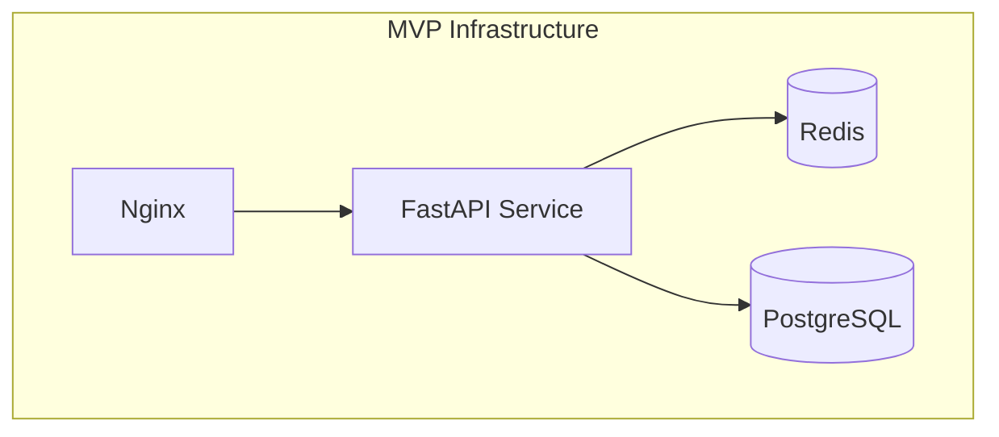
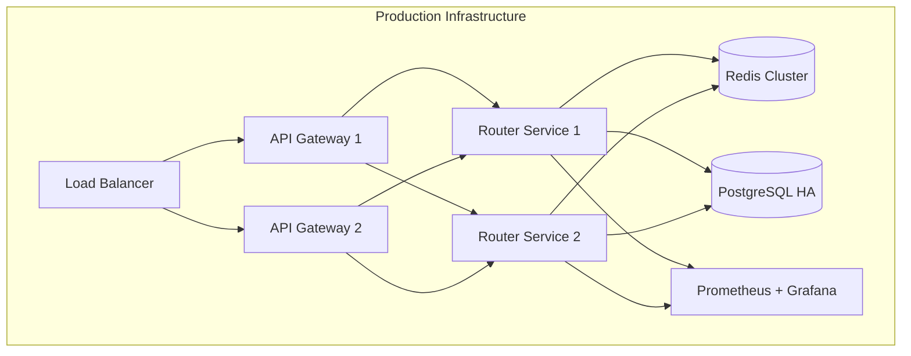

# XRouter Deployment Documentation

## MVP Deployment (Python)

### Infrastructure Overview


### Requirements

#### Hardware Requirements (Single Server)
- CPU: 4 cores
- RAM: 8GB
- Storage: 100GB SSD
- Network: 100Mbps

#### Software Requirements
```yaml
infrastructure:
  python: "3.11+"
  nginx: "1.25+"
  
databases:
  postgresql: "15+"
  redis: "7.0+"
  
monitoring:
  prometheus: "2.45+"
  grafana: "10.0+"
```

### Deployment Process

#### 1. System Setup
```bash
# Update system
sudo apt update && sudo apt upgrade

# Install dependencies
sudo apt install python3.11 python3.11-venv nginx redis postgresql
```

#### 2. Application Setup
```bash
# Create virtual environment
python3.11 -m venv venv
source venv/bin/activate

# Install requirements
pip install -r requirements.txt

# Setup environment
cp .env.example .env
vim .env  # Configure environment variables
```

#### 3. Database Setup
```bash
# Create database
sudo -u postgres createdb xrouter
sudo -u postgres psql -d xrouter -f schema.sql

# Configure connection
vim .env  # Update DATABASE_URL
```

#### 4. Service Setup
```bash
# Create systemd service
sudo vim /etc/systemd/system/xrouter.service

[Unit]
Description=XRouter Service
After=network.target

[Service]
User=xrouter
WorkingDirectory=/opt/xrouter
Environment=PATH=/opt/xrouter/venv/bin
ExecStart=/opt/xrouter/venv/bin/uvicorn main:app --host 0.0.0.0 --port 8000
Restart=always

[Install]
WantedBy=multi-user.target

# Start service
sudo systemctl enable xrouter
sudo systemctl start xrouter
```

#### 5. Nginx Setup
```nginx
server {
    listen 80;
    server_name api.xrouter.ru;

    location / {
        proxy_pass http://localhost:8000;
        proxy_set_header Host $host;
        proxy_set_header X-Real-IP $remote_addr;
    }
}
```

## Production Deployment (Go)

### Infrastructure Overview


### Requirements

#### Hardware Requirements (Per Node)
- **API Gateway**: 4 cores, 8GB RAM
- **Router Service**: 8 cores, 16GB RAM
- **Database**: 8 cores, 32GB RAM
- **Cache**: 4 cores, 16GB RAM

#### Software Requirements
```yaml
infrastructure:
  golang: "1.21+"
  kubernetes: "1.25+"
  docker: "24.0+"
  
databases:
  postgresql: "15+"
  redis: "7.0+"
  
monitoring:
  prometheus: "2.45+"
  grafana: "10.0+"
```

### Deployment Process

#### 1. Infrastructure Setup
```bash
# Initialize Terraform
terraform init

# Create infrastructure
terraform apply -var-file=prod.tfvars

# Setup Kubernetes
kubectl apply -f k8s/namespace.yaml
```

#### 2. Database Setup
```bash
# Deploy PostgreSQL HA
helm install postgresql bitnami/postgresql-ha \
  --values postgresql-values.yaml

# Deploy Redis Cluster
helm install redis bitnami/redis-cluster \
  --values redis-values.yaml
```

#### 3. Application Deployment
```bash
# Deploy API Gateway
kubectl apply -f k8s/api-gateway/

# Deploy Router Service
kubectl apply -f k8s/router-service/

# Deploy monitoring
kubectl apply -f k8s/monitoring/
```

### High Availability

#### Database HA
```yaml
postgresql-ha:
  replicaCount: 3
  postgresql:
    replication:
      synchronousCommit: "on"
      numSynchronousReplicas: 1

redis-cluster:
  cluster:
    nodes: 6
    replicas: 1
```

#### Service HA
```yaml
apiVersion: apps/v1
kind: Deployment
metadata:
  name: router-service
spec:
  replicas: 3
  strategy:
    type: RollingUpdate
  template:
    spec:
      affinity:
        podAntiAffinity:
          preferredDuringSchedulingIgnoredDuringExecution:
          - weight: 100
            podAffinityTerm:
              topologyKey: kubernetes.io/hostname
```

### Monitoring

#### Prometheus Configuration
```yaml
prometheus:
  scrape_configs:
    - job_name: 'xrouter'
      kubernetes_sd_configs:
        - role: pod
      relabel_configs:
        - source_labels: [__meta_kubernetes_pod_label_app]
          regex: xrouter
          action: keep
```

#### Grafana Dashboards
- Request Rate and Latency
- Error Rate by Provider
- Token Usage
- Resource Utilization

### Backup Strategy

#### Database Backup
```bash
# Automated backup script
#!/bin/bash
TIMESTAMP=$(date +%Y%m%d_%H%M%S)
BACKUP_DIR="/backups/postgresql"

# Backup PostgreSQL
pg_dumpall -U postgres > "$BACKUP_DIR/full_backup_$TIMESTAMP.sql"

# Rotate backups (keep last 7 days)
find $BACKUP_DIR -type f -mtime +7 -delete
```

### Security

#### Network Policies
```yaml
apiVersion: networking.k8s.io/v1
kind: NetworkPolicy
metadata:
  name: router-service-policy
spec:
  podSelector:
    matchLabels:
      app: router-service
  policyTypes:
  - Ingress
  - Egress
  ingress:
  - from:
    - podSelector:
        matchLabels:
          app: api-gateway
```

#### Secret Management
```yaml
apiVersion: v1
kind: Secret
metadata:
  name: xrouter-secrets
type: Opaque
data:
  db-password: <base64>
  redis-password: <base64>
  provider-keys: <base64>