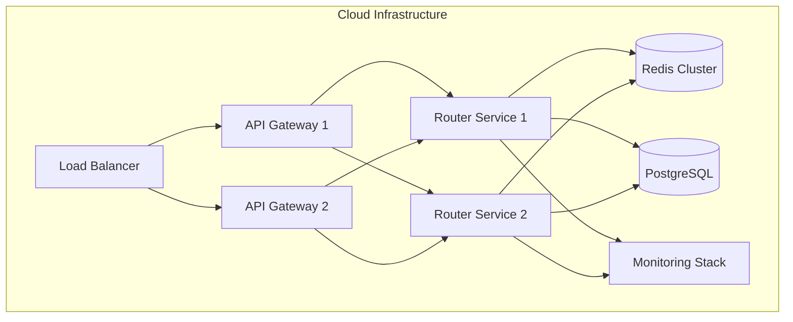

# XRouter Deployment Documentation

## Infrastructure Overview

### Production Environment


## Deployment Requirements

### Hardware Requirements
- **API Gateway**:
  - CPU: 4 cores minimum
  - RAM: 8GB minimum
  - Storage: 50GB SSD
  - Network: 1Gbps

- **Router Service**:
  - CPU: 8 cores minimum
  - RAM: 16GB minimum
  - Storage: 100GB SSD
  - Network: 1Gbps

- **Database**:
  - CPU: 8 cores minimum
  - RAM: 32GB minimum
  - Storage: 500GB SSD
  - Network: 1Gbps

- **Cache**:
  - CPU: 4 cores minimum
  - RAM: 16GB minimum
  - Storage: 100GB SSD
  - Network: 1Gbps

### Software Requirements
```yaml
infrastructure:
  kubernetes: "1.25+"
  docker: "24.0+"
  nginx: "1.25+"
  
databases:
  postgresql: "15+"
  redis: "7.0+"
  
monitoring:
  prometheus: "2.45+"
  grafana: "10.0+"
  elasticsearch: "8.0+"
  
security:
  certManager: "1.12+"
  vault: "1.13+"
```

## Deployment Process

### 1. Infrastructure Setup
```bash
# Initialize Terraform
terraform init

# Create infrastructure
terraform apply -var-file=prod.tfvars

# Configure DNS
kubectl apply -f k8s/ingress/
```

### 2. Database Setup
```bash
# Deploy PostgreSQL
helm install postgresql bitnami/postgresql -f values-postgresql.yaml

# Deploy Redis
helm install redis bitnami/redis -f values-redis.yaml

# Initialize schemas
kubectl apply -f k8s/jobs/db-init/
```

### 3. Core Services Deployment
```bash
# Deploy API Gateway
kubectl apply -f k8s/api-gateway/

# Deploy Router Service
kubectl apply -f k8s/router-service/

# Deploy Provider Manager
kubectl apply -f k8s/provider-manager/
```

### 4. Monitoring Setup
```bash
# Deploy Prometheus
helm install prometheus prometheus-community/prometheus -f values-prometheus.yaml

# Deploy Grafana
helm install grafana grafana/grafana -f values-grafana.yaml

# Deploy ELK Stack
helm install elastic elastic/elasticsearch -f values-elastic.yaml
```

## Scaling Strategy

### Horizontal Scaling
```yaml
apiVersion: autoscaling/v2
kind: HorizontalPodAutoscaler
metadata:
  name: router-service-hpa
spec:
  scaleTargetRef:
    apiVersion: apps/v1
    kind: Deployment
    name: router-service
  minReplicas: 2
  maxReplicas: 10
  metrics:
  - type: Resource
    resource:
      name: cpu
      target:
        type: Utilization
        averageUtilization: 70
```

### Vertical Scaling
- Monitor resource usage
- Adjust resource limits based on usage patterns
- Use node pools with different resource configurations

## High Availability

### Database HA
```yaml
postgresql:
  replication:
    enabled: true
    slaveReplicas: 2
    synchronousCommit: "on"
    numSynchronousReplicas: 1
```

### Cache HA
```yaml
redis:
  cluster:
    enabled: true
    slaveCount: 2
  sentinel:
    enabled: true
    quorum: 2
```

### Service HA
- Multiple replicas across availability zones
- Liveness and readiness probes
- Circuit breakers and fallbacks
- Regular backup and disaster recovery

## Security Measures

### Network Security
```yaml
apiVersion: networking.k8s.io/v1
kind: NetworkPolicy
metadata:
  name: router-service-policy
spec:
  podSelector:
    matchLabels:
      app: router-service
  policyTypes:
  - Ingress
  - Egress
  ingress:
  - from:
    - podSelector:
        matchLabels:
          app: api-gateway
    ports:
    - protocol: TCP
      port: 8080
```

### Secret Management
```yaml
apiVersion: secrets-store.csi.x-k8s.io/v1
kind: SecretProviderClass
metadata:
  name: vault-provider
spec:
  provider: vault
  parameters:
    vaultAddress: "https://vault:8200"
    roleName: "router-service"
    objects: |
      - objectName: "api-keys"
        secretPath: "secret/data/router-service/api-keys"
```

## Monitoring Setup

### Prometheus Configuration
```yaml
prometheus:
  scrape_configs:
    - job_name: 'router-service'
      kubernetes_sd_configs:
        - role: pod
      relabel_configs:
        - source_labels: [__meta_kubernetes_pod_label_app]
          regex: router-service
          action: keep
```

### Grafana Dashboards
```yaml
grafana:
  dashboards:
    default:
      router-overview:
        file: dashboards/router-overview.json
      provider-metrics:
        file: dashboards/provider-metrics.json
```

## Backup Strategy

### Database Backups
```bash
# Automated backup script
#!/bin/bash
TIMESTAMP=$(date +%Y%m%d_%H%M%S)
BACKUP_DIR="/backups/postgresql"

# Backup PostgreSQL
pg_dump -Fc -f "$BACKUP_DIR/db_backup_$TIMESTAMP.dump"

# Upload to object storage
aws s3 cp "$BACKUP_DIR/db_backup_$TIMESTAMP.dump" \
    "s3://xrouter-backups/postgresql/"
```

### Configuration Backups
- Git-based configuration management
- Regular exports of custom resources
- Backup of Kubernetes secrets

## Maintenance Procedures

### Rolling Updates
```bash
# Update API Gateway
kubectl set image deployment/api-gateway \
    api-gateway=xrouter/api-gateway:new-version --record

# Monitor rollout
kubectl rollout status deployment/api-gateway
```

### Database Maintenance
```sql
-- Regular maintenance tasks
VACUUM ANALYZE;
REINDEX DATABASE xrouter;
```

### Health Checks
```yaml
livenessProbe:
  httpGet:
    path: /health
    port: 8080
  initialDelaySeconds: 30
  periodSeconds: 10

readinessProbe:
  httpGet:
    path: /ready
    port: 8080
  initialDelaySeconds: 5
  periodSeconds: 5
```

## Disaster Recovery

### Recovery Procedures
1. Assess the impact and identify affected components
2. Restore from latest backup if data loss occurred
3. Review and update affected configurations
4. Verify system integrity and functionality
5. Document incident and update procedures

### Failover Process
```mermaid
sequenceDiagram
    participant Primary
    participant Secondary
    participant LoadBalancer
    
    Primary->>Primary: Health Check Fails
    Primary->>Secondary: Notify Failure
    Secondary->>Secondary: Promote to Primary
    Secondary->>LoadBalancer: Update Routes
    LoadBalancer->>Secondary: Route Traffic