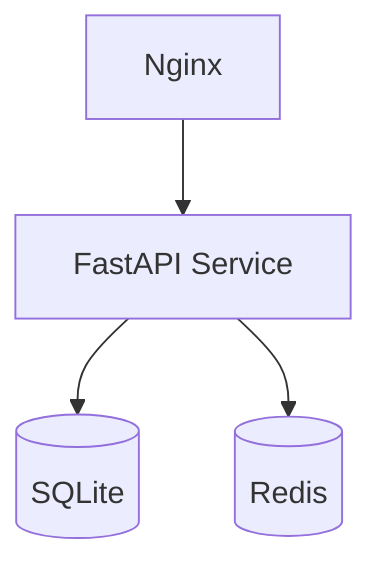
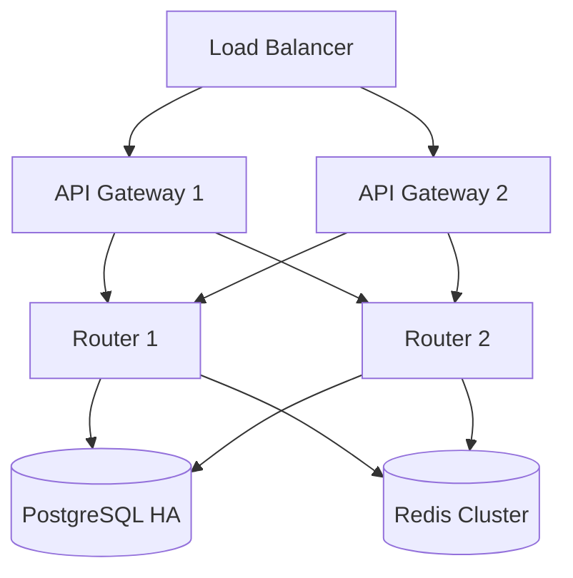
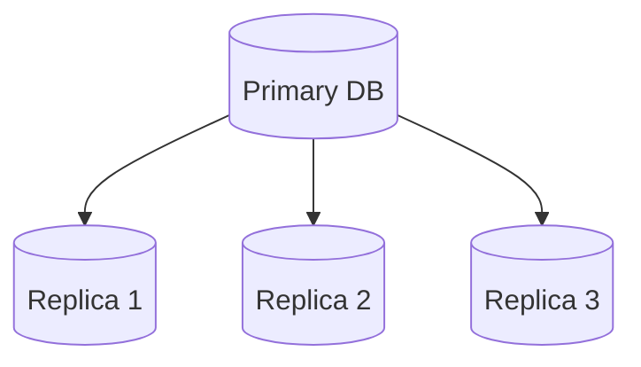
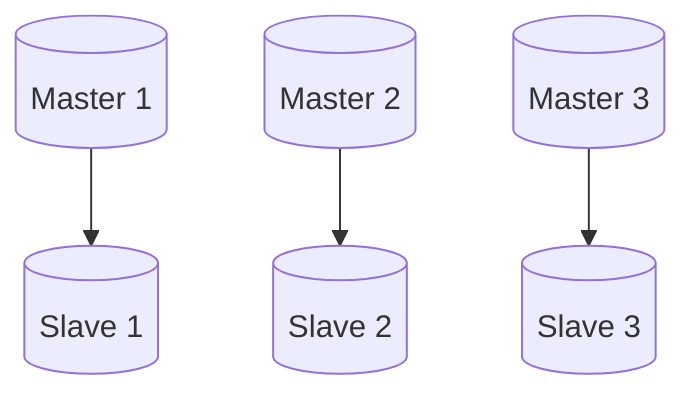
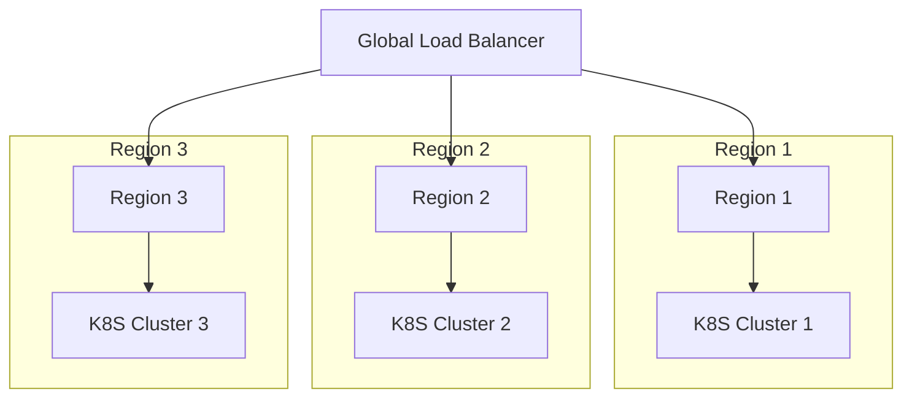

# XRouter Scaling Architecture

## Overview

XRouter спроектирован для горизонтального масштабирования с учетом роста нагрузки и требований к производительности.

## MVP Scaling (Python)

### Single Node Setup


### Limitations
- Single FastAPI instance
- SQLite database
- Single Redis instance
- Limited concurrent requests

### Scaling Points
- CPU bound operations
- Memory usage
- Disk I/O
- Network capacity

## Production Scaling (Go)

### Kubernetes Architecture


### Horizontal Scaling

#### API Gateway
```yaml
apiVersion: autoscaling/v2
kind: HorizontalPodAutoscaler
metadata:
  name: api-gateway-hpa
spec:
  scaleTargetRef:
    apiVersion: apps/v1
    kind: Deployment
    name: api-gateway
  minReplicas: 2
  maxReplicas: 10
  metrics:
  - type: Resource
    resource:
      name: cpu
      target:
        type: Utilization
        averageUtilization: 70
```

#### Router Service
```yaml
apiVersion: autoscaling/v2
kind: HorizontalPodAutoscaler
metadata:
  name: router-service-hpa
spec:
  scaleTargetRef:
    apiVersion: apps/v1
    kind: Deployment
    name: router-service
  minReplicas: 2
  maxReplicas: 20
  metrics:
  - type: Resource
    resource:
      name: cpu
      target:
        type: Utilization
        averageUtilization: 70
```

### Database Scaling

#### PostgreSQL HA


#### Redis Cluster


## Load Balancing

### Layer 4 (Network)
- TCP load balancing
- Connection tracking
- Health checking
- Failover

### Layer 7 (Application)
- Path-based routing
- Rate limiting
- SSL termination
- Request filtering

## Performance Optimization

### Caching Strategy
- API key validation cache
- Rate limit counters
- Provider status cache
- Monitoring metrics

### Connection Pooling
- Database connections
- Redis connections
- HTTP clients
- gRPC streams

## Resource Management

### CPU Allocation
```yaml
resources:
  requests:
    cpu: 500m
  limits:
    cpu: 2000m
```

### Memory Allocation
```yaml
resources:
  requests:
    memory: 512Mi
  limits:
    memory: 2Gi
```

## Capacity Planning

### Metrics to Monitor
- Request rate
- Response time
- Error rate
- Resource usage

### Scaling Triggers
- CPU > 70%
- Memory > 80%
- Response time > 500ms
- Error rate > 1%

## Geographic Distribution

### Multi-Region Setup


### Data Replication
- Database replication
- Cache synchronization
- Configuration management
- Metrics aggregation

## Cost Optimization

### Resource Optimization
- Right-sizing instances
- Autoscaling policies
- Spot instances
- Reserved capacity

### Traffic Optimization
- CDN usage
- Request batching
- Response compression
- Connection reuse

## Scaling Roadmap

### MVP Phase
1. Single node deployment
2. Basic monitoring
3. Manual scaling
4. Performance testing

### Production Phase
1. Kubernetes deployment
2. Autoscaling
3. HA databases
4. Multi-region support