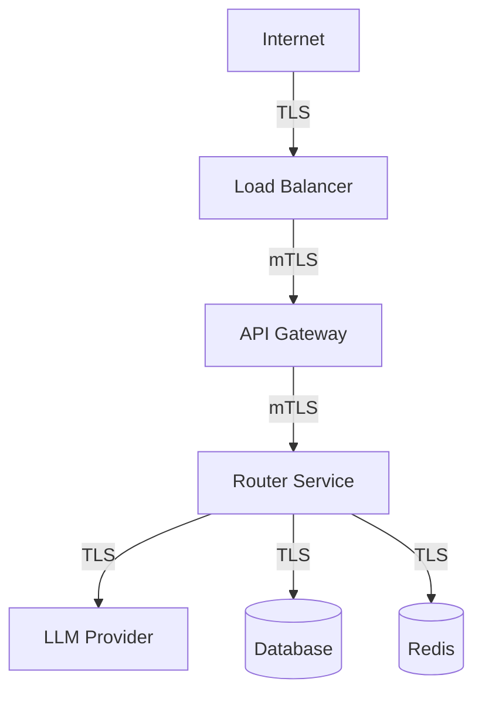
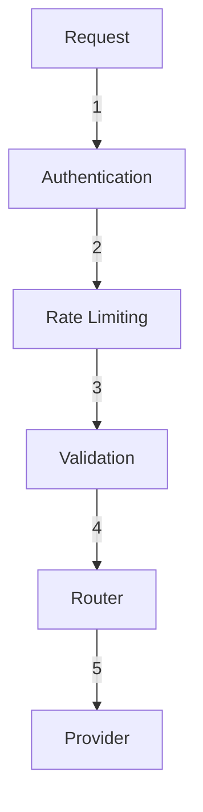

# XRouter Security Architecture

## Overview

XRouter реализует многоуровневый подход к безопасности для защиты данных и обеспечения надежной работы сервиса.

## Authentication & Authorization

### OAuth 2.0 + PKCE
- Безопасная авторизация для веб-приложений
- PKCE для защиты от перехвата кода
- JWT токены с годовым сроком
- Мгновенный отзыв токенов

### API Keys
- Безопасный формат ключей
- Хэширование в базе данных
- Rate limiting по ключам
- IP whitelist (опционально)

## Network Security

### TLS/SSL
- TLS 1.3
- Strong ciphers only
- Perfect forward secrecy
- HSTS enabled

### Network Policies
```yaml
apiVersion: networking.k8s.io/v1
kind: NetworkPolicy
metadata:
  name: router-policy
spec:
  podSelector:
    matchLabels:
      app: router
  policyTypes:
  - Ingress
  - Egress
  ingress:
  - from:
    - podSelector:
        matchLabels:
          app: gateway
```

## Data Security

### Data at Rest
- Database encryption
- Secure key storage
- Encrypted backups
- Data retention policies

### Data in Transit
- TLS everywhere
- mTLS для внутренних сервисов
- VPC peering
- Encrypted backups

## Access Control

### RBAC
- Принцип наименьших привилегий
- Разделение ролей
- Аудит доступа
- Regular review

### Service Accounts
- Dedicated service accounts
- Limited permissions
- Key rotation
- Access monitoring

## Secrets Management

### Infrastructure Secrets
```yaml
apiVersion: v1
kind: Secret
metadata:
  name: provider-credentials
type: Opaque
data:
  gigachat-key: <base64>
  yandex-key: <base64>
```

### Application Secrets
- Environment variables
- Secure vault storage
- Regular rotation
- Access logging

## Security Monitoring

### Logging
- Security events
- Access logs
- Error logs
- Audit logs

### Alerting
- Suspicious activity
- Authentication failures
- Rate limit violations
- Configuration changes

## Incident Response

### Severity Levels
1. Critical: Breach detected
2. High: Potential breach
3. Medium: Security warning
4. Low: Minor issue

### Response Steps
1. Detect & Alert
2. Assess Impact
3. Contain Threat
4. Investigate
5. Remediate
6. Report
7. Improve

## Compliance

### Standards
- GDPR ready
- SOC 2 ready
- ISO 27001 ready
- PCI DSS ready

### Auditing
- Regular security audits
- Penetration testing
- Vulnerability scanning
- Code reviews

## Security Controls

### Infrastructure


### Application


## Security Best Practices

### Development
- Secure coding guidelines
- Dependency scanning
- SAST/DAST
- Security reviews

### Operations
- Change management
- Access control
- Monitoring
- Incident response

### Deployment
- Immutable infrastructure
- Security scanning
- Configuration validation
- Automated testing

## Security Roadmap

### MVP Phase
- Basic authentication
- TLS encryption
- Rate limiting
- Error handling

### Production Phase
- Advanced monitoring
- Intrusion detection
- Automated response
- Compliance controls