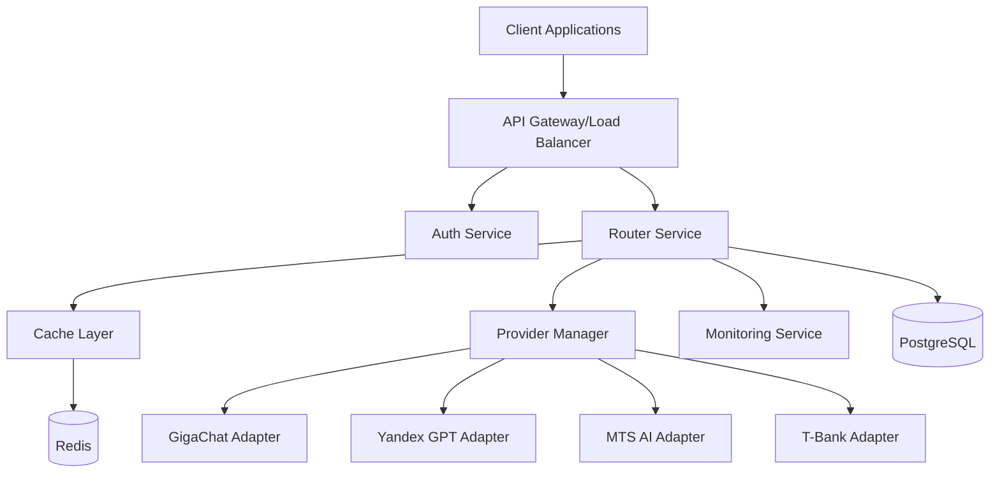
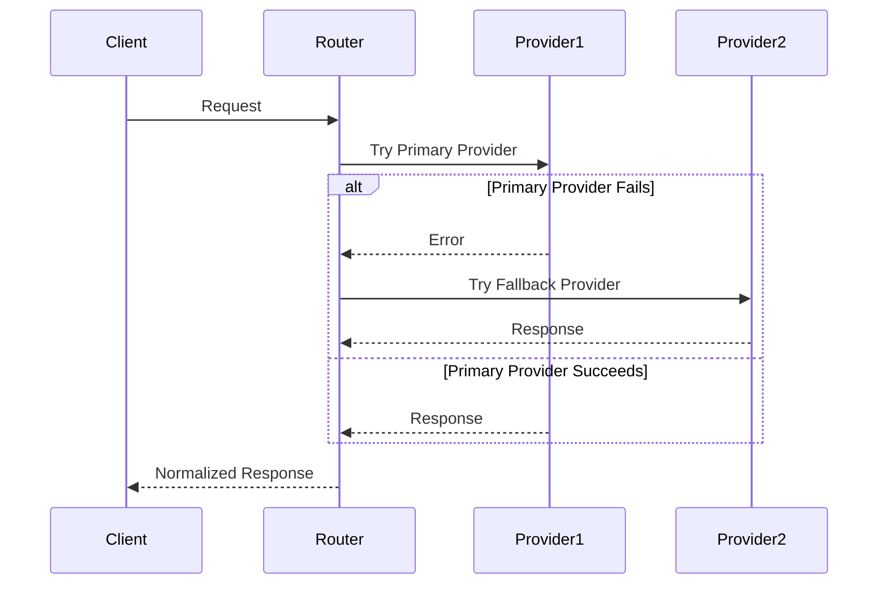

# XRouter System Overview

## System Architecture

### High-Level Overview
XRouter is designed as a distributed system that acts as an intelligent router and adapter between client applications and various Russian LLM providers. The system follows a microservices architecture pattern to ensure scalability, maintainability, and fault tolerance.

## Core Components

### 1. API Gateway
- **Purpose**: Entry point for all client requests
- **Responsibilities**:
  - Request validation
  - Rate limiting
  - SSL termination
  - Load balancing
  - Request routing
  - API versioning

### 2. Router Service
- **Purpose**: Core routing and orchestration logic
- **Responsibilities**:
  - Provider selection
  - Request transformation
  - Response normalization
  - Error handling
  - Fallback management
  - Load balancing between providers

### 3. Provider Manager
- **Purpose**: Manages connections and interactions with LLM providers
- **Responsibilities**:
  - Provider health monitoring
  - Connection pooling
  - Request retry logic
  - Provider-specific error handling
  - API version compatibility

### 4. Authentication Service
- **Purpose**: Handles user authentication and authorization
- **Responsibilities**:
  - OAuth 2.0 with PKCE implementation
  - API key management
  - Token validation
  - Permission management
  - Rate limit enforcement

### 5. Monitoring Service
- **Purpose**: System health and performance monitoring
- **Responsibilities**:
  - Performance metrics collection
  - Error tracking
  - Provider availability monitoring
  - Usage statistics
  - Alert management

## Data Flow

### Request Processing
1. Client sends request to API Gateway
2. Gateway validates request and performs authentication
3. Router Service determines appropriate provider(s)
4. Provider Manager handles provider communication
5. Response is normalized and returned to client

### Fallback Mechanism

## System Boundaries

### External Interfaces
1. **Client API**
   - REST API endpoints
   - WebSocket connections for streaming
   - OAuth 2.0 endpoints

2. **Provider APIs**
   - GigaChat API
   - Yandex GPT API
   - MTS AI API
   - T-Bank API

3. **Monitoring Interfaces**
   - Prometheus metrics
   - Grafana dashboards
   - Alert manager webhooks

### Internal Communication
- REST/gRPC between services
- Redis pub/sub for real-time updates
- PostgreSQL for persistent storage
- Redis for caching and session management

## Integration Points

### Provider Integration
Each LLM provider is integrated through a dedicated adapter that:
- Handles authentication
- Transforms requests
- Normalizes responses
- Manages rate limits
- Handles provider-specific errors

### Monitoring Integration
- Prometheus for metrics collection
- Grafana for visualization
- ELK Stack for log aggregation
- Alert Manager for notifications

### Client Integration
- OpenAI-compatible API
- SDK support for major languages
- WebSocket support for streaming
- OAuth 2.0 for authentication

## Security Measures

### Authentication & Authorization
- OAuth 2.0 with PKCE
- API key authentication
- JWT token validation
- Role-based access control

### Data Protection
- End-to-end encryption
- Secure credential storage
- Data anonymization
- Audit logging

### Network Security
- TLS 1.3
- Rate limiting
- DDoS protection
- IP whitelisting

## Scalability Considerations

### Horizontal Scaling
- Stateless services
- Load balancer configuration
- Database sharding
- Cache distribution

### Vertical Scaling
- Resource optimization
- Performance monitoring
- Capacity planning
- Load testing

## Monitoring & Observability

### Metrics Collection
- Request/response times
- Error rates
- Provider availability
- Resource utilization

### Logging
- Structured logging
- Log aggregation
- Error tracking
- Audit trails

### Alerting
- Performance thresholds
- Error rate thresholds
- Provider availability
- Resource utilization

## Future Considerations

### Planned Improvements
- Additional provider integrations
- Enhanced caching strategies
- Advanced routing algorithms
- Improved monitoring capabilities

### Potential Challenges
- Provider API changes
- Scaling requirements
- Security requirements
- Performance optimization