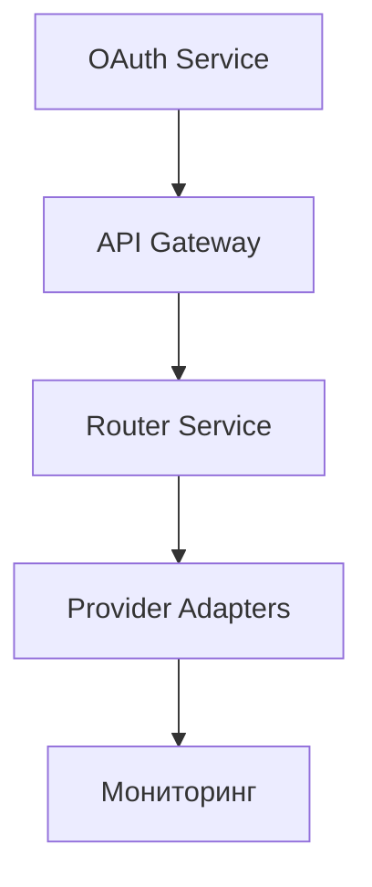

# XRouter Migration Guide

## Overview

Этот документ описывает процесс миграции XRouter с Python MVP на Go Production версию.

## Этапы миграции

### 1. Подготовка к миграции

#### 1.1. Анализ текущей системы
- [ ] Аудит компонентов
- [ ] Анализ зависимостей
- [ ] Профилирование производительности
- [ ] Выявление узких мест

#### 1.2. Планирование миграции
- [ ] Определение этапов
- [ ] Оценка рисков
- [ ] План отката
- [ ] График миграции

### 2. Миграция данных

#### 2.1. SQLite to PostgreSQL
```bash
# 1. Дамп данных из SQLite
sqlite3 xrouter.db .dump > dump.sql

# 2. Конвертация схемы
./convert_schema.py dump.sql > postgres_schema.sql

# 3. Импорт в PostgreSQL
psql -U postgres -d xrouter -f postgres_schema.sql
```

#### 2.2. Валидация данных
```sql
-- Проверка целостности
SELECT COUNT(*) FROM users;
SELECT COUNT(*) FROM api_keys;
SELECT COUNT(*) FROM usage_stats;

-- Проверка связей
SELECT * FROM api_keys WHERE user_id NOT IN (SELECT id FROM users);
```

### 3. Миграция кода

#### 3.1. Компоненты для миграции
1. OAuth Service
2. API Gateway
3. Router Service
4. Provider Adapters
5. Мониторинг

#### 3.2. Порядок миграции


### 4. Инфраструктурная миграция

#### 4.1. Kubernetes Setup
```yaml
# Namespace
apiVersion: v1
kind: Namespace
metadata:
  name: xrouter-prod

# Secrets
apiVersion: v1
kind: Secret
metadata:
  name: db-credentials
type: Opaque
data:
  username: <base64>
  password: <base64>

# ConfigMap
apiVersion: v1
kind: ConfigMap
metadata:
  name: xrouter-config
data:
  database_url: "postgresql://..."
  redis_url: "redis://..."
```

#### 4.2. Service Migration
```yaml
# API Gateway
apiVersion: apps/v1
kind: Deployment
metadata:
  name: api-gateway
spec:
  replicas: 2
  template:
    spec:
      containers:
      - name: api-gateway
        image: xrouter/api-gateway:1.0.0

# Router Service
apiVersion: apps/v1
kind: Deployment
metadata:
  name: router-service
spec:
  replicas: 2
  template:
    spec:
      containers:
      - name: router-service
        image: xrouter/router:1.0.0
```

### 5. Процедура миграции

#### 5.1. Pre-Migration
- [ ] Backup всех данных
- [ ] Тестирование новой версии
- [ ] Подготовка инфраструктуры
- [ ] Уведомление пользователей

#### 5.2. Migration
1. Развертывание новой инфраструктуры
2. Миграция данных
3. Переключение трафика
4. Валидация работы
5. Откат при необходимости

#### 5.3. Post-Migration
- [ ] Мониторинг производительности
- [ ] Сбор метрик
- [ ] Обработка инцидентов
- [ ] Документирование проблем

### 6. Валидация миграции

#### 6.1. Функциональные тесты
- [ ] API endpoints
- [ ] OAuth flow
- [ ] Provider интеграции
- [ ] Rate limiting

#### 6.2. Нефункциональные тесты
- [ ] Производительность
- [ ] Масштабируемость
- [ ] Надежность
- [ ] Безопасность

### 7. Rollback Plan

#### 7.1. Триггеры отката
- Критические ошибки
- Потеря данных
- Недоступность сервиса
- Проблемы безопасности

#### 7.2. Процедура отката
1. Остановка миграции
2. Восстановление бэкапов
3. Переключение на старую версию
4. Валидация работы
5. Анализ проблем

## Временные рамки

### Фаза 1: Подготовка (1 неделя)
- Анализ системы
- Планирование
- Подготовка инфраструктуры

### Фаза 2: Миграция (2 недели)
- Развертывание
- Миграция данных
- Переключение трафика

### Фаза 3: Стабилизация (1 неделя)
- Мониторинг
- Оптимизация
- Документация

## Риски и митигация

### Технические риски
1. Потеря данных
   - Регулярные бэкапы
   - Валидация данных
   - Процедуры восстановления

2. Простои сервиса
   - Blue-green deployment
   - Быстрый откат
   - Тестирование процедур

### Бизнес риски
1. Недовольство пользователей
   - Четкая коммуникация
   - Поддержка 24/7
   - Быстрое решение проблем

2. Проблемы производительности
   - Мониторинг метрик
   - Оптимизация кода
   - Масштабирование ресурсов