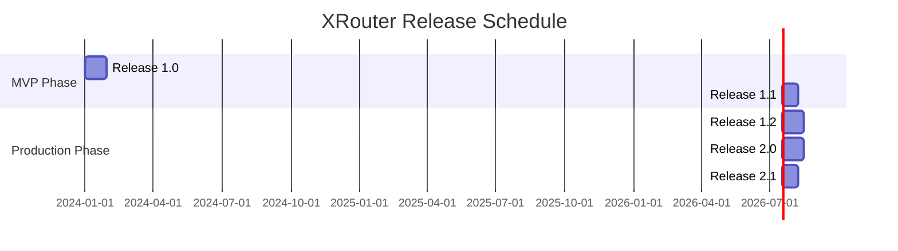

# XRouter Release Plan

## Release Overview

### Release 1.0 - MVP (Python)
**Focus**: OAuth, API Gateway, and GigaChat integration
**Timeline**: 4 weeks

#### Key Features:
1. OAuth 2.0 with PKCE
2. API key management UI
3. Basic API Gateway
4. GigaChat integration
5. Core monitoring

#### Success Criteria:
- OAuth and API keys working
- Successfully route requests to GigaChat
- Response time < 500ms (without provider latency)
- Error rate < 1%

---

### Release 1.1 - YandexGPT
**Focus**: Add YandexGPT support with versioning
**Timeline**: 3 weeks

#### Key Features:
1. YandexGPT integration
2. Version support (:latest, :rc, :deprecated)
3. Enhanced error handling
4. Basic fallback mechanisms
5. Enhanced monitoring

#### Success Criteria:
- All YandexGPT versions working
- Automatic fallback working
- Response time maintained
- Error rate < 0.5%

---

### Release 1.2 - Go Migration
**Focus**: Rewrite core services in Go
**Timeline**: 4 weeks

#### Key Features:
1. OAuth service in Go
2. API Gateway in Go
3. Rate limiting
4. Basic monitoring
5. Performance optimization

#### Success Criteria:
- All core features working
- Better performance than Python
- Successful migration
- No service disruption

---

### Release 2.0 - Production Infrastructure
**Focus**: Production-grade deployment
**Timeline**: 4 weeks

#### Key Features:
1. Kubernetes deployment
2. HA PostgreSQL
3. Redis cluster
4. Advanced monitoring
5. SLA tracking

#### Success Criteria:
- High availability working
- Scalability tested
- Monitoring comprehensive
- SLA metrics tracked

---

### Release 2.1 - Enterprise Features
**Focus**: Enterprise capabilities
**Timeline**: 3 weeks

#### Key Features:
1. Team management
2. Usage analytics
3. Billing system
4. Custom domains
5. Advanced rate limiting

#### Success Criteria:
- Team features working
- Billing accurate
- Analytics detailed
- Enterprise ready

## Development Phases

### Phase 1 (MVP - Python)
- OAuth and key management
- Basic provider integration
- Simple routing
- Basic monitoring

### Phase 2 (Production - Go)
- Core services rewrite
- Infrastructure setup
- Enterprise features
- Advanced monitoring

## Release Schedule

## Release Dependencies

### Infrastructure Dependencies
- Cloud infrastructure setup
- Database setup
- Monitoring setup
- CI/CD pipeline

### External Dependencies
- Provider API access
- API documentation
- Test accounts
- Production credentials

## Risk Management

### Release Risks
1. Provider API changes
2. Performance issues
3. Security vulnerabilities
4. Migration complexity

### Mitigation Strategies
1. Regular provider communication
2. Performance testing
3. Security audits
4. Comprehensive testing

## Success Metrics

### Technical Metrics
- API response time (without provider latency)
- Error rates
- System uptime
- Resource usage

### Business Metrics
- Number of requests
- Provider distribution
- Cost efficiency
- User satisfaction

## Release Process

### Pre-Release
1. Feature freeze
2. Testing completion
3. Documentation update
4. Performance validation

### Release
1. Database migrations
2. Service deployment
3. Monitoring setup
4. Security verification

### Post-Release
1. Monitor performance
2. Track errors
3. Gather feedback
4. Plan improvements