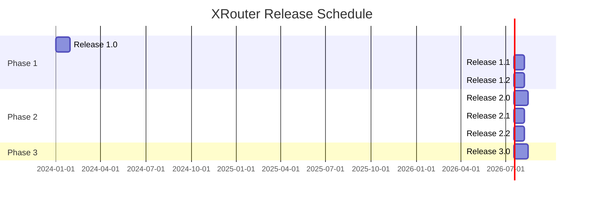

# XRouter Release Plan

## Release Overview

### Release 1.0 - Foundation (MVP)
**Focus**: Basic routing functionality with GigaChat integration
**Timeline**: 4 weeks

#### Key Features:
1. Basic API Gateway
2. GigaChat provider integration
3. Simple routing logic
4. Basic authentication
5. Core monitoring

#### Success Criteria:
- Successfully route requests to GigaChat
- Basic authentication working
- Response time < 500ms
- Error rate < 1%

---

### Release 1.1 - Yandex Integration
**Focus**: Add Yandex GPT support and improve routing
**Timeline**: 3 weeks

#### Key Features:
1. Yandex GPT integration
2. Enhanced routing logic
3. Improved error handling
4. Basic fallback mechanisms
5. Enhanced monitoring

#### Success Criteria:
- Successful integration with Yandex GPT
- Automatic fallback working
- Response time maintained < 500ms
- Error rate < 0.5%

---

### Release 1.2 - Advanced Routing
**Focus**: Intelligent routing and load balancing
**Timeline**: 3 weeks

#### Key Features:
1. Cost-based routing
2. Load balancing
3. Advanced fallback strategies
4. Performance monitoring
5. Usage analytics

#### Success Criteria:
- Optimal cost routing working
- Load balanced requests
- Improved response times
- Detailed analytics available

---

### Release 2.0 - Enterprise Features
**Focus**: MTS and T-Bank integration, advanced features
**Timeline**: 4 weeks

#### Key Features:
1. MTS AI integration
2. T-Bank integration
3. Advanced authentication
4. Rate limiting
5. Usage quotas

#### Success Criteria:
- All providers integrated
- Enterprise authentication working
- Rate limiting effective
- Quota management working

---

### Release 2.1 - Caching & Performance
**Focus**: Performance optimization and caching
**Timeline**: 3 weeks

#### Key Features:
1. Response caching
2. Request optimization
3. Performance monitoring
4. Cache management
5. Analytics dashboard

#### Success Criteria:
- Cache hit rate > 80%
- Response time < 200ms
- Resource usage optimized
- Real-time analytics working

---

### Release 2.2 - Streaming & Advanced Features
**Focus**: Streaming support and advanced features
**Timeline**: 3 weeks

#### Key Features:
1. SSE implementation
2. WebSocket support
3. Advanced error handling
4. Custom routing rules
5. Enhanced monitoring

#### Success Criteria:
- Streaming working reliably
- Custom routing effective
- Error handling improved
- Monitoring comprehensive

---

### Release 3.0 - Production Ready
**Focus**: Production hardening and enterprise features
**Timeline**: 4 weeks

#### Key Features:
1. High availability setup
2. Disaster recovery
3. Enterprise security
4. Advanced analytics
5. SLA management

#### Success Criteria:
- 99.9% uptime achieved
- DR plan tested
- Security audited
- SLA monitoring working

## Development Phases

### Phase 1 (Releases 1.0-1.2)
- Core functionality
- Basic provider integration
- Simple routing
- Basic monitoring

### Phase 2 (Releases 2.0-2.2)
- Additional providers
- Advanced features
- Performance optimization
- Enhanced monitoring

### Phase 3 (Release 3.0)
- Production hardening
- Enterprise features
- Advanced security
- Comprehensive monitoring

## Release Schedule

## Release Dependencies

### Infrastructure Dependencies
- Cloud infrastructure setup
- Database setup
- Monitoring setup
- CI/CD pipeline

### External Dependencies
- Provider API access
- API documentation
- Test accounts
- Production credentials

## Risk Management

### Release Risks
1. Provider API changes
2. Performance issues
3. Security vulnerabilities
4. Integration complexity

### Mitigation Strategies
1. Regular provider communication
2. Performance testing
3. Security audits
4. Comprehensive testing

## Success Metrics

### Technical Metrics
- API response time
- Error rates
- System uptime
- Cache hit rates

### Business Metrics
- Number of requests
- Provider distribution
- Cost efficiency
- User satisfaction

## Release Process

### Pre-Release
1. Feature freeze
2. Testing completion
3. Documentation update
4. Performance validation

### Release
1. Database migrations
2. Service deployment
3. Monitoring setup
4. Security verification

### Post-Release
1. Monitor performance
2. Track errors
3. Gather feedback
4. Plan improvements